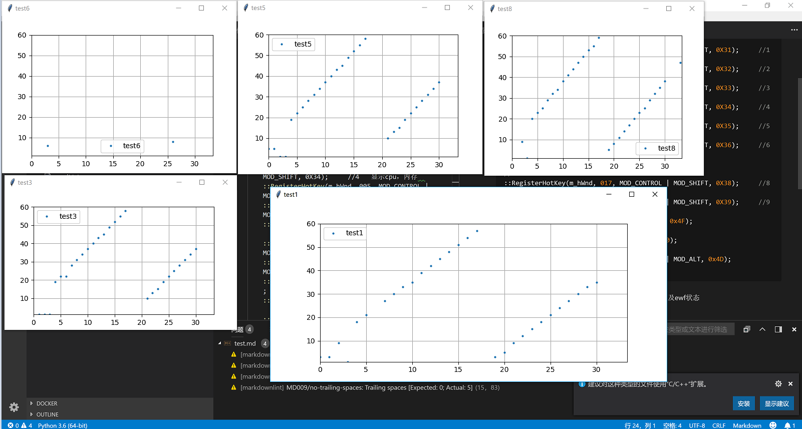

# Screen-Spider
周期性截取屏幕指定区域的图片，利用ocr识别出自定区域数字，自动记录到xlsx文件中，同时绘制出图标

用于股票平均成本的截取，记录，分析

依赖库：
* apscheduler：定时任务框架
* PIL：图片处理库
* pytesseract：tesseract-OCR的python调用封装
* matplotlib：绘图库

配置文件参数：
* rect：指定要截取的矩形区域，可设置多个
* step：截取的时间间隔
* ylimit_min：作图时y轴的最小值
* ylimit_max: 作图时y轴的最大值
* display-par：windows桌面的缩放倍数

几个文件的作用：
* catcher.py：开始截取，只在股票开盘时间工作
* catcher_run.py：开始截取，立刻工作
* collector.py：周期性截取图片并保存，用作tesseract-OCR训练数据
* show_image.py:测试抓取点是否准确
* test.py：测试识别结果

